# Лабораторная работа № 2: Сборка Web сервера (WAMP)

Целью данной работы является ознакомление с устройством / принципами работы Web сервера Apache. Данную работу необходимо выполнять в OS Windows, работать с дистрибутивами, упакованными в архивы (__не инсталяторы!__).

## Подготовка

Скачайте последнюю доступные версии программ:

1. [__Apache HTTP Server__](https://httpd.apache.org) для Windows. Обратите внимание, что на официальном сайте не предоставляется необходимый для Windows пакет, однако его можно скачать по двум первым ссылкам (_ApacheHaus_ или _ApacheLounge_).
2. [__MariaDB Server__](https://mariadb.org/) для Windows - __ZIP__ файл.
3. [__интерпретатор языка PHP__](https://php.net) для Windows, с расширением Apache. При посещении страницы скачивания интерпретатора обратите внимание на левую колонку страницы - она поможет вам определиться с выбором пакета для скачивания.

## Выполнение

На диске __С:__ (на диске __D:__) создайте директорию `server`, внутри которой создайте директории `www`, `tmp`, `usr`, `log`.

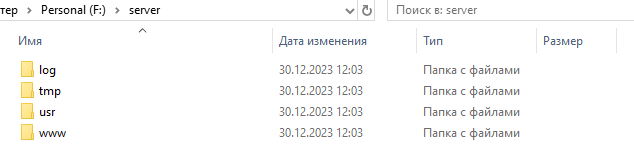


В директорию `usr` распакуйте скачаные архивы. Постарайтесь каждую программу расположить в своей папке, например, __Apache HTTP Server__ в папке `httpd`, __MariaDb Server__ в папке `mariadb`, __PHP__ в папке `php`.

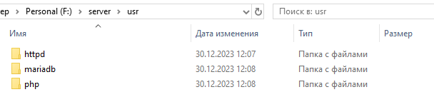

В файле конфигурации WEB сервера (`httpd.conf`) подключите модуль взаимодействия с PHP. Данный модуль поставляется вместе с интерпретатором php (для php 7.x он называется `php7apache2_4.dll`). Настройте директорию сайта. Для этого установите параметры `DocumentRoot` и `Directory` равными `c:\server\www`.

1. Задаем правильный путь для `ServerRoot`
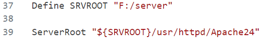
2. Подключаем модуль взаимодействия с PHP
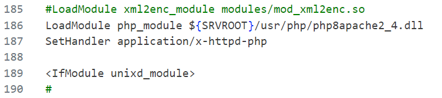
3. Настраиваем директорию сайта
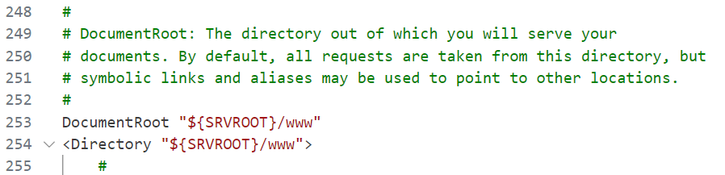

В конфигурационном файле интерпретатора php (`php.ini`) подключите поддержку mysql (`php_mysqli`, `php_pdo_mysql`). Установите создание временных файлов в директорию `c:\server\tmp` (параметр `sys_temp_dir`).

1. Конфигурационный файл `php.ini-production`
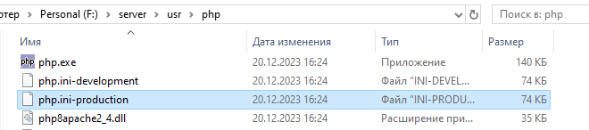
Переименован в файл `php.ini`
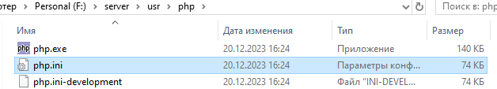
2. Указываем путь к папке с расширениями
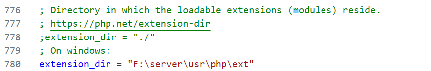
3. Подключаем поддержку `php_mysqli, php_pdo_mysql`
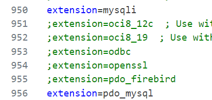
4. Устанавливаем создание временных файлов в директорию `F:\server\tmp`
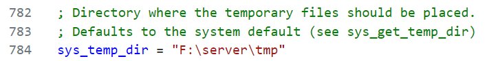

Перенаправьте создание всех логов (apache, mysql, php) в директорию `c:\server\log`.
1. Настройка логов для apache
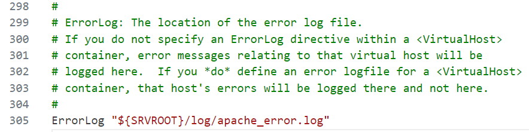
2. Настройка логов для mysql
    - запущен файл `mysql_install_db.exe` для того, чтобы создалась папка `data`, а вместе с ней, файл `my.ini`
    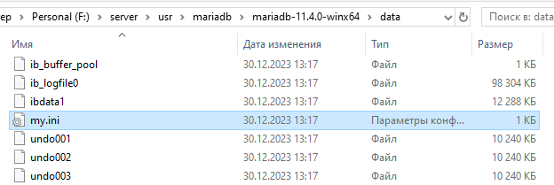
    - добавляем конфиг для логов
    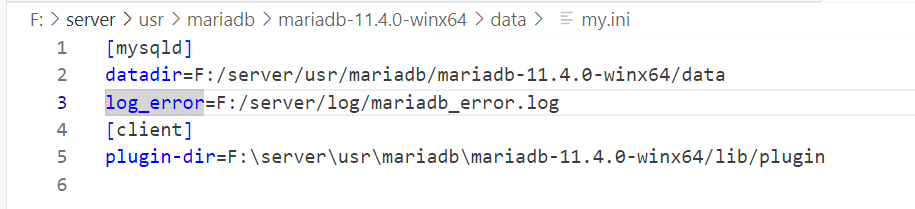
3. Настройка логов для php
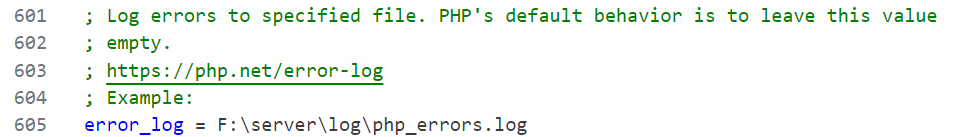

Создайте в директории `c:\server\www` файл `index.php` со следующим содержимым:

```php
<?php phpinfo();
```
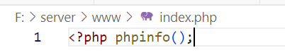

## Запуск и тестирование

Запустите сервер базы данных _MariaDb_. Для этого найдите в папке `c:\server\usr\mariadb\bin` файл `mysqld.exe` и запустите его. Подробнее [установка MariaDB](https://mariadb.com/kb/en/installing-mariadb-windows-zip-packages/).
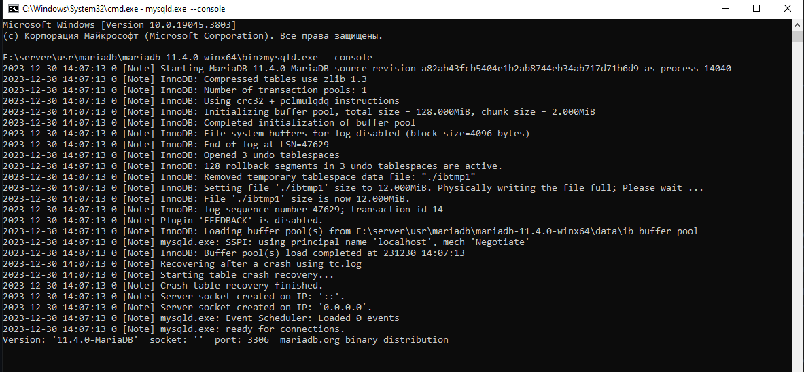

Запустите _Apache HTTP Server_. Для этого найдите в папке `c:\server\usr\httpd\bin` файл `httpd.exe` и запустите его. 

Была запрошена конфигурация `ServerName`
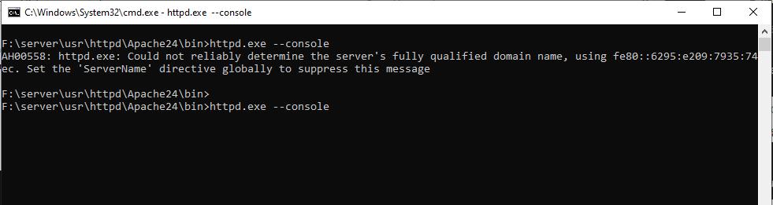

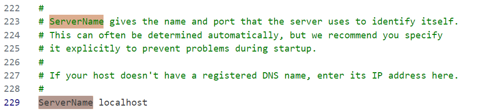

Откройте в браузере URL `http://localhost`.

Получаем 403 Forbidden :)
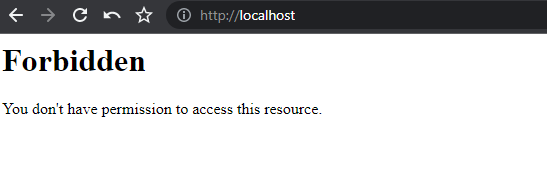

Добавляем `index.php` в `DirectoryIndex`
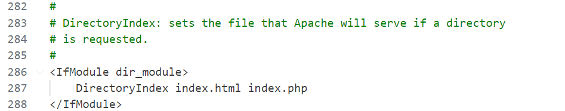
Перезапускаем сервер

Вуаля
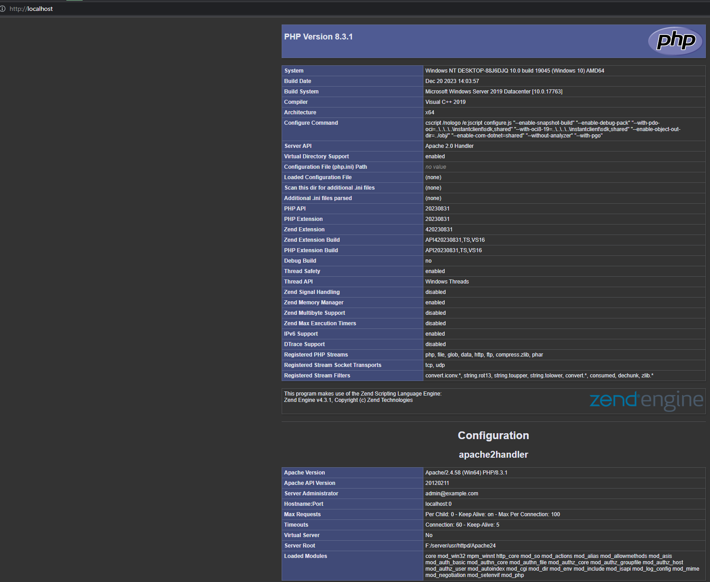

## Отчет

Предоставьте отчет о проделаной работе.

Ответьте на следующие вопросы
 
1. При открытии ссылки `http://localhost` в браузере отображается информация окружения интерпретатора PHP. Какую операционную систему указывает PHP?
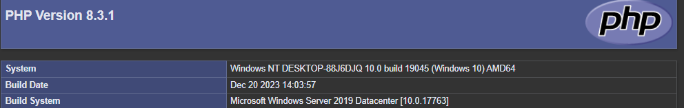
2. В группе _Apache Environment_ (на той же странице) найдите переменную `HTTP_ACCEPT`. Чему равно её значение?

3. Сколько оперативной памяти выделяется под выполнение скрипта PHP (переменная `memory_limit` из группы _Core_)?

4. Существуют готовые сборки сервера Apache под Windows. Как они называются и в чем их особенности?  

Готовые сборки сервера Apache под Windows:
1. `WampServer`:
    - Описание: WampServer — это легковесная сборка для Windows, которая включает в себя Apache, MySQL и PHP. Также иногда включают phpMyAdmin для удобного управления базами данных MySQL.
    - Особенности: Прост в установке и использовании, предоставляет легкий способ настроить локальное веб-окружение на Windows.
2. `Denwer`:
    - Описание: Denwer — это набор для Windows, включающий в себя Apache, MySQL, PHP, Perl, а также другие компоненты, такие как phpMyAdmin, Zend Optimizer и др.
    - Особенности: Обеспечивает удобство в настройке и содержит дополнительные инструменты для разработки.
3. `XAMPP`:
    - Описание: XAMPP — кроссплатформенная сборка, доступная не только для Windows, но и для Linux и macOS. Она включает в себя Apache, MariaDB (вместо MySQL), PHP и Perl.
    - Особенности: Позволяет быстро развернуть локальное окружение для веб-разработки с минимальными усилиями.
4. `EasyPHP`:
    - Описание: EasyPHP — еще одна легковесная сборка для Windows, включающая Apache, MySQL и PHP. Предназначен для облегчения установки и настройки веб-сервера на локальном компьютере.
    - Особенности: Имеет простой интерфейс для управления сервером и базами данных.


У меня на пк есть установленный `XAMPP` и я решил сравнить, какой размер по итогу получился у папки `server` и какой размер имеет папка `xampp`
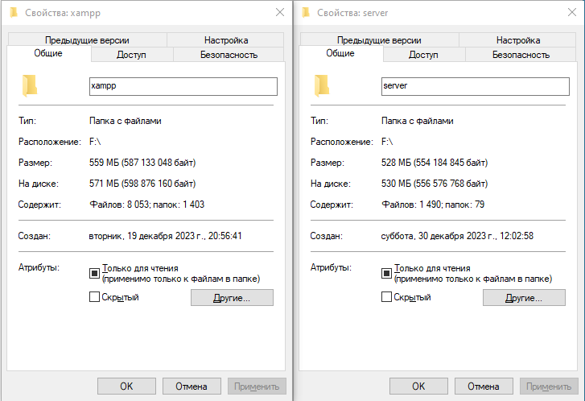
Получилось, что ручная сборка весит на несколько десятков мегабайт меньше, а также содержит в разы меньше файлов и папок  

## Вывод

В ходе выполнения лабораторной работы по сборке веб-сервера (WAMP) на операционной системе Windows были изучены основные принципы устройства и конфигурации веб-сервера Apache, а также интеграции с сервером баз данных MariaDB и интерпретатором языка программирования PHP. Процесс сборки веб-сервера включал в себя загрузку и распаковку последних версий соответствующих компонентов.
Мы научились тому, как можно вручную подготовить среду для разработки, не прибегая уже к готовым решениям и не запуская никаких установочных файлов.