# Лабораторная работа № 3: Запуск сайта в контейнере.

Целью данной работы является ознакомление с запуском сайтов (виртуальных хостов) в контейнере. Также студент ознакомится со способом создания кластера контейнеров и рассмотрит установку сайтов на базе Wordpress.

В результате выполнения данной работы будет получен кластер из 3-х контейнеров:

 - __Apache HTTP server__ - контейнер принимает запросы и переправляет их серверу PHP-FPM;
 - __PHP-FPM__ - контейнер с сервером PHP-FPM;
 - __MariaDB__ - контейнер с серером баз данных.

## Подготовка

Проверьте, что у вас установлен и запущен _Docker Desktop_.

Создайте папку `asweb03`. В ней будет выполняться вся работа.

Создайте папки `database` - для базы данных, `files` - для хранения конфигураций и `site` - в данной папке будет расположен сайт.

Лабораторная работа выполняется при подключении к сети Internet, так как скачиваются образы из репозитория https://hub.docker.com

## Выполнение

Скачайте [CMS Wordpress](https://wordpress.org/) и распакуйте в папку `site`. У вас должна появиться в папке `site` папка `wordpress` с исходным кодом сайта.

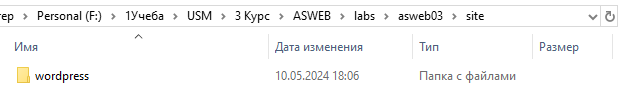

### Контейнер Apache HTTP Server

Для начала создадим конфигурационный файл для Apache HTTP Server. Для этого выполните следующие команды в консоли:

```shell
# команда скачивает образ httpd и запускает на его основе контейнер с именем httpd
docker run -d --name httpd  httpd:2.4

# копируем конфигурационный файл из контейнера в папку .\files\httpd
docker cp httpd:/usr/local/apache2/conf/httpd.conf .\files\httpd\httpd.conf

# останавливаем контейнер httpd
docker stop httpd

# удаляем контейнер
docker rm httpd
```

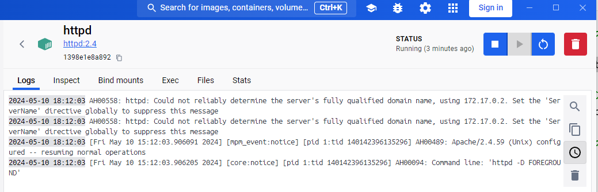

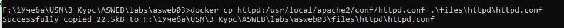

В созданом файле `.\files\httpd\httpd.conf` раскоментируйте строки, содержащие подключение расширений `mod_proxy.so`, `mod_proxy_http.so`, `mod_proxy_fcgi.so`.

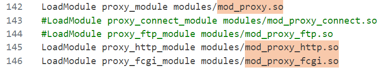

Найдите в конфигурационном файле объявление параметра `ServerName`. Под ним добавьте следующие строки:

```
# определение доменного имени сайта
ServerName wordpress.localhost:80
# перенаправление php запросов контейнеру php-fpm
ProxyPassMatch ^/(.*\.php(/.*)?)$ fcgi://php-fpm:9000/var/www/html/$1
# индексный файл
DirectoryIndex /index.php index.php
```

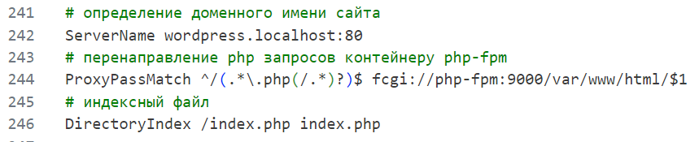

Также найдите определение параметра `DocumentRoot` и задайте ему значение `/var/www/html`, как и в следующей за параметром строке.

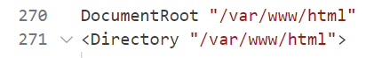

Создайте файл `Dockerfile.httpd` со следующим содержимым:

```dockerfile
FROM httpd:2.4

RUN apt update && apt upgrade -y

COPY ./files/httpd/httpd.conf /usr/local/apache2/conf/httpd.conf
```

Подробноcти работы с контейнером _httpd_ можно узнать здесь: [HTTPD Container](https://hub.docker.com/_/httpd).

### Контейнер PHP-FPM

Создайте файл `Dockerfile.php-fpm` со следующим содержимым:

```dockerfile
FROM php:7.4-fpm

RUN apt-get update && apt-get upgrade -y && apt-get install -y \
		libfreetype6-dev \
		libjpeg62-turbo-dev \
		libpng-dev
RUN docker-php-ext-configure gd --with-freetype --with-jpeg \
	&& docker-php-ext-configure pdo_mysql \
	&& docker-php-ext-install -j$(nproc) gd mysqli
```

Подробноcти работы с контейнером _php_ можно узнать здесь: [PHP Container](https://hub.docker.com/_/php).

### Контейнер MariaDB

Создайте файл `Dockerfile.mariadb` со следующим содержимым:

```dockerfile
FROM mariadb:10.8

RUN apt-get update && apt-get upgrade -y
```

Подробноcти работы с контейнером _mariadb_ можно узнать здесь: [MariaDB Container](https://hub.docker.com/_/mariadb).

### Сборка решения

Создайте файл `docker-compose.yml` со следующим содержимым:

```yaml
version: '3.9'

services:
  httpd:
    build:
      context: ./
      dockerfile: Dockerfile.httpd
    networks:
      - internal
    ports:
      - "80:80"
    volumes:
      - "./site/wordpress/:/var/www/html/"
  php-fpm:
    build:
      context: ./
      dockerfile: Dockerfile.php-fpm
    networks:
      - internal
    volumes:
      - "./site/wordpress/:/var/www/html/"
  mariadb:
    build: 
      context: ./
      dockerfile: Dockerfile.mariadb
    networks:
      - internal
    environment:
     MARIADB_DATABASE: sample
     MARIADB_USER: sampleuser
     MARIADB_PASSWORD: samplepassword
     MARIADB_ROOT_PASSWORD: rootpassword
    volumes:
      - "./database/:/var/lib/mysql"
networks:
  internal: {}
```

Данный файл объявляет структуру из трех контейнеров: http как точка входа, контейнер php-fpm и контейнер с базой данных. Для взаимодействия контейнеров объявляется также сеть `internal` с настройками по умолчанию.

## Запуск и тестирование

В папке лабораторной работы откройте консоль и выполните команду:

```shell
docker-compose build
```

На основе созданных определений docker построит образы сервисов. _Сколько секунд собирвался проект?_

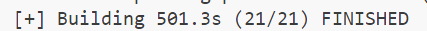

Выполните команду:

```shell
docker-compose up -d
```
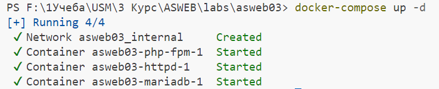

На основе образов запустятся контейнеры. Откройте в браузере страницу: http://wordpress.localhost и произведите установку сайта. __Обратите внимание, что контейнеры видят друг друга по имени, поэтому, при установке сайта надо прописывать для сервера базы данных имя хоста, равное имени контенера, то есть `mariadb`__. Имя пользователя базы данных, его пароль и название базы данных возьмите из файла `docker-compose.yml`.

### Настройка сайта

1. Страница Welcome 
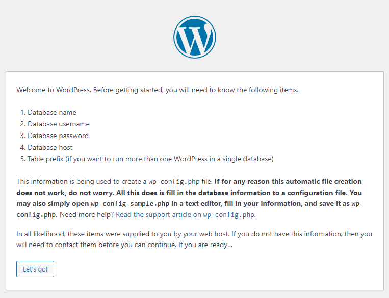
2. Настройка БД
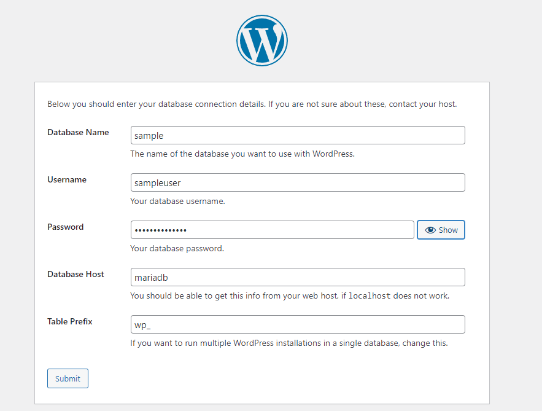
3. Подтверждение запуска установки
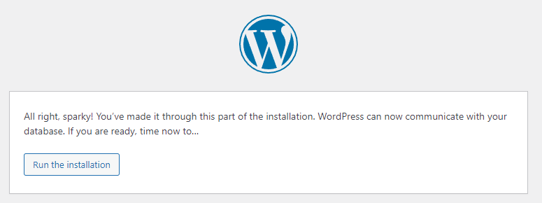
4. Настройка юзера
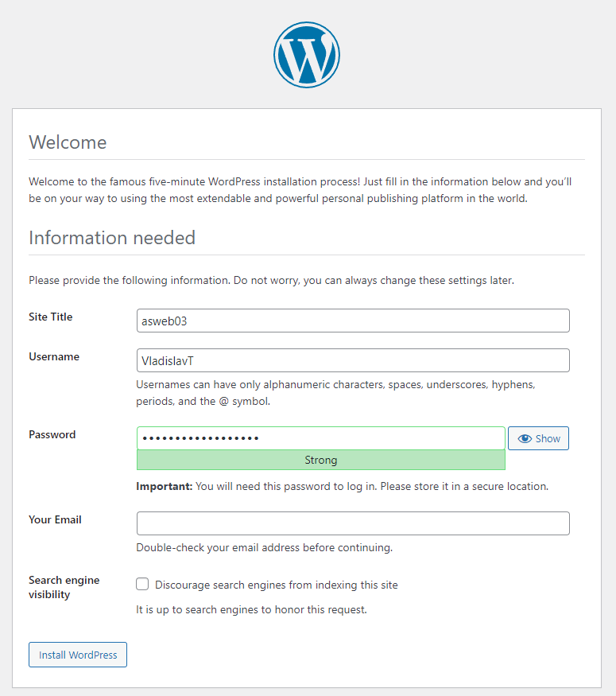
5. Результат
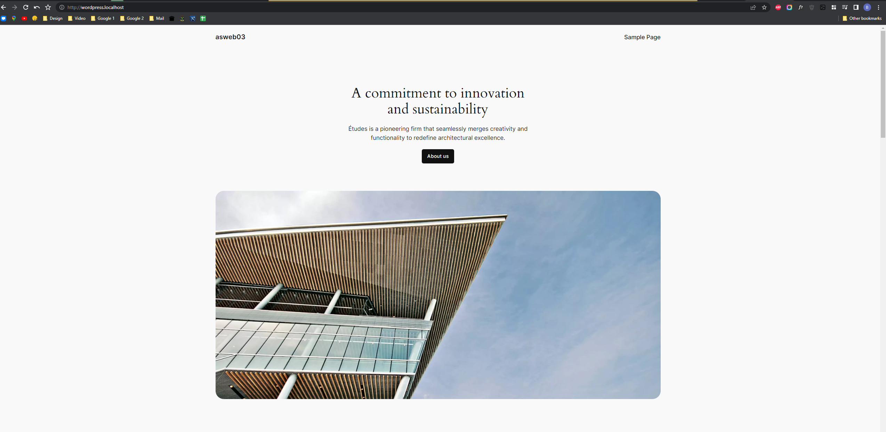

Выполните последовательно следующие команды

```shell
# остановить контейнеры
docker-compose down
# удалить контейнеры
docker-compose rm
```
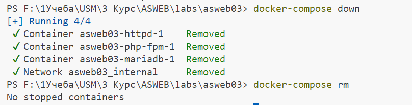

Проверьте, открывается ли сайт http://wordpress.localhost . 
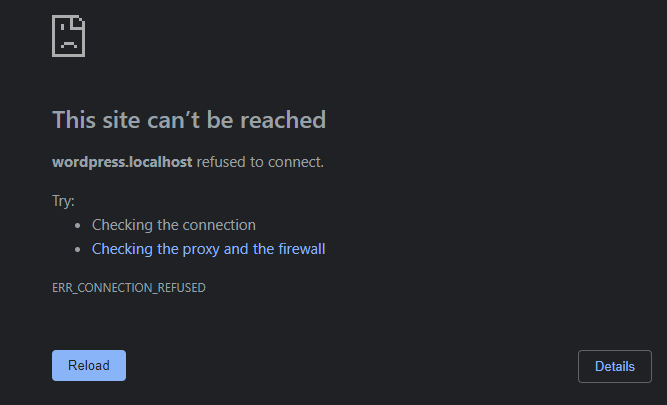

Снова запустите кластер контейнеров:

```shell
docker-compose up -d
```

и проверьте работоспособность сайта.
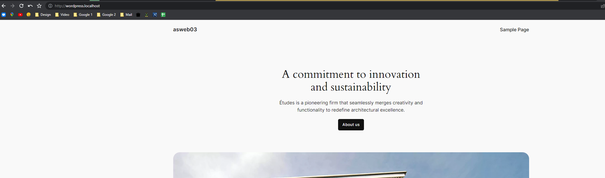

## Отчет

Предоставьте отчет о проделаной работе.

Ответьте на следующие вопросы:

* Как скопировать файл из контейнера в хостовый компьютер?
__С помощью команды `docker cp`: `docker cp [имя контейнера]:[путь к файлу в контейнере] [путь куда скопировать на хосте]`__
* За что отвечает директива `DocumentRoot` в конфигурационном файле Apache HTTP Server?
__Директива `DocumentRoot` в конфигурационном файле Apache HTTP Server определяет корневой каталог, из которого сервер будет обслуживать файлы для запросов клиентов. Все запросы, не совпадающие с явно указанными виртуальными хостами, будут обслуживаться из этого каталога.__
* В файле `docker-compose.yml` папка `database` хоста монтируется в папку `/var/lib/mysql` контейнера `mariadb`. Для чего монтируют к контейнеру базы данных папку? __Папка базы данных на хостовом компьютере монтируется к контейнеру базы данных для сохранения данных на постоянное хранилище вне контейнера. Это позволяет сохранить данные даже при остановке или удалении контейнера, обеспечивая сохранность данных между перезапусками контейнера.__


## Вывод

В ходе выполнения лабораторной работы по запуску сайта в контейнере были изучены основные принципы создания многоконтейнерного приложения с использованием Docker. Был создан кластер из трех контейнеров, включающий веб-сервер Apache HTTP Server, сервер PHP-FPM и сервер баз данных MariaDB.

Процесс подготовки и сборки приложения включал в себя настройку конфигурационных файлов, создание Dockerfile для каждого контейнера и использование Docker Compose для объединения контейнеров в единое приложение.

После успешного запуска контейнеров и установки сайта WordPress была проверена работоспособность сайта, а также изучены основные инструменты работы с Docker, такие как сборка образов, запуск и остановка контейнеров.