# Лабораторная работа № 5: Элементы безопасности Web сервера

При использовании сайта на базе кластера контейнеров большая часть ответственности по безопасности ложится на плечи администратора облака. Однако, ряд шагов, необходимых для обеспечения безопасности (стабильности), должен выполнить разработчик (DevOps).

## Подготовка

Работа выполняется на базе результата Л.Р. №4.

Проверьте, что у вас установлен и запущен _Docker Desktop_.

Создайте папку `asweb05`. В ней будет выполняться вся работа.

Скопируйте в папку `asweb05` содержимое папки `asweb04`.

Лабораторная работа выполняется при подключении к сети Internet, так как скачиваются образы из репозитория https://hub.docker.com

## Выполнение

### поиск уязвимостей

Выполните сборку 

```shell
docker-compose build
```
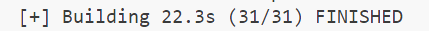

Откройте __Docker Desktop__, перейдите во вкладку _Images_. Дайте поиск по слову _asweb05_ - в списке будет 4 образа. 
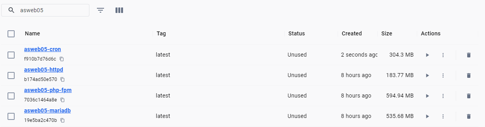
Просмотрите каждый образ: по нажатию на него запускается сканирование его на уязвимости.

_В каких образах найдены уязвимости?_

asweb05-cron
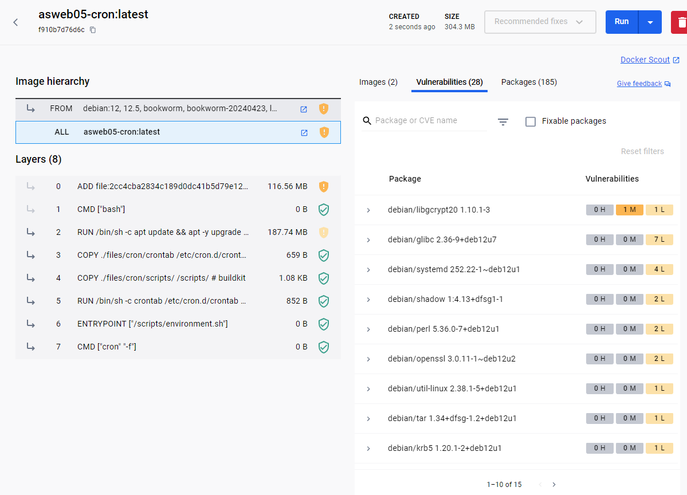

asweb05-httpd


asweb05-php-fpm
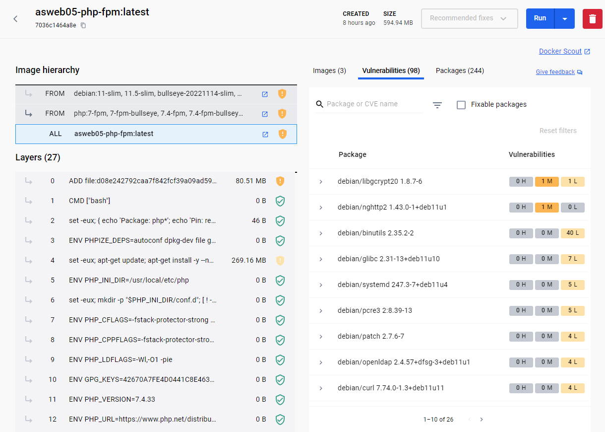

asweb05-mariadb
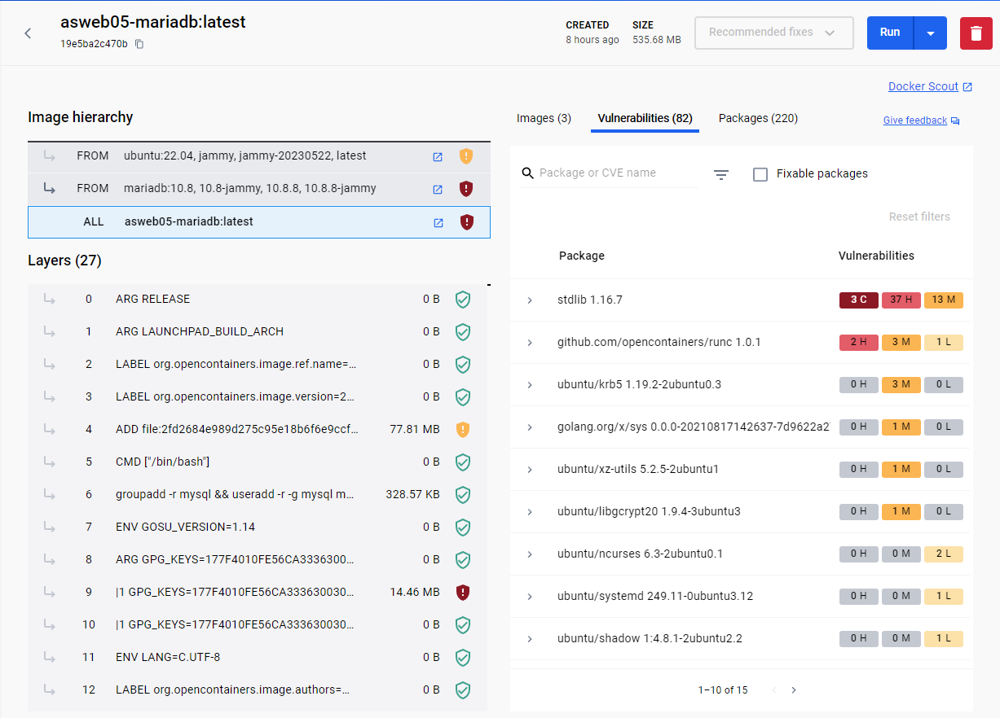

В файле `Dockerfile.php-fpm` поменяйте первую строку на следующую:

```dockerfile
FROM php:8.1-fpm
```

Пересоберите образы и снова проверьте контейнер php-fpm на уязвимости.
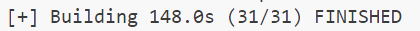

Количество уязвимостей на более новой версии уменьшилось с 98 на 50:
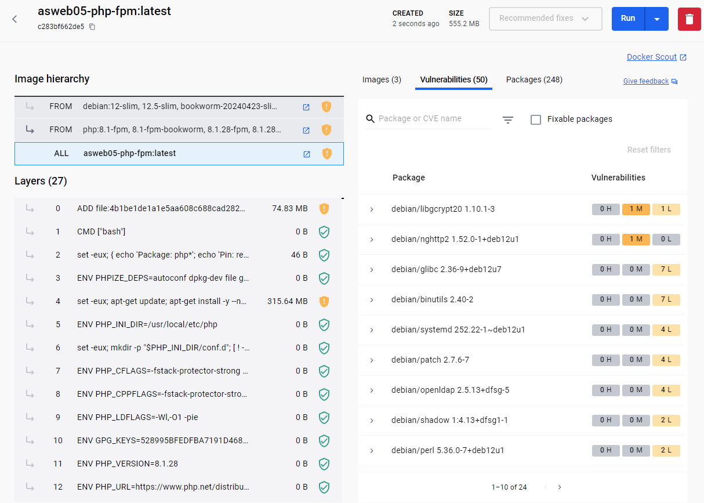

### ограничение ресурсов контейнера

В файле `docker-compose.yml` в описании сервиса `httpd` под ключом `build` добавьте следующий ключ:

```yaml
    deploy:
      resources:
        limits:
          cpus: "0.50"
          memory: 256M
        reservations:
          cpus: "0.25"
          memory: 128M
```
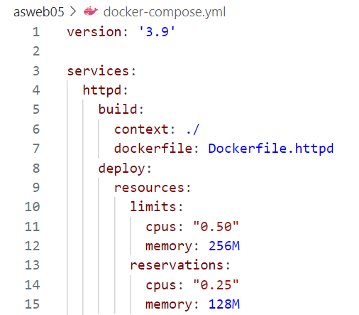

Таким образом ограничиваем потребление процессора и памяти сервисом `httpd`. Подобные ограничения пропишите для всех контейнеров.

### задание условий стабильности

Для обеспечения стабильности (restart policy) решения часто указывают правила перезагрузки контейнера.

Добавьте к определению `deploy` сервиса `httpd` следующий ключ:

```yaml
    deploy:
      ...
      restart_policy:
        condition: on-failure
        delay: 3s
        max_attempts: 5
        window: 60s
```
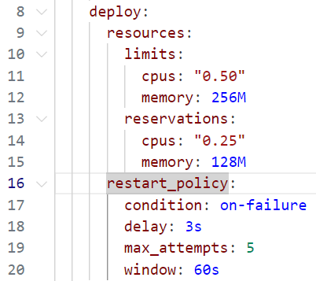

Добавьте подобные определения для всех сервисов.

### уменьшение размера образа

Для уменьшения образов используются различные практики. В работе будем удалять следы после обновления пакетов.

В файле `Dockerfile.httpd` обновите вторую строку, записав её следующим образом:

```dockerfile
RUN apt update && apt upgrade -y \
	&& rm -rf /var/lib/apt/lists/*
```

Добавленная команда удаляет скачаные списки из репозиториев. Добавьте её во все описания образов после команды обновления системы.
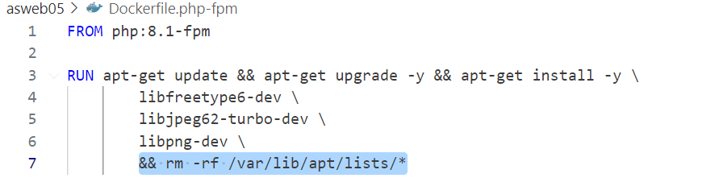
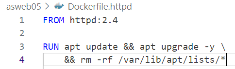
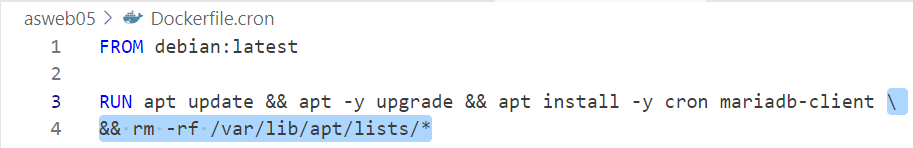
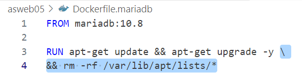

В файле `Dockerfile.cron` обновите вторую строку, записав её следующим образом:

```dockerfile
RUN apt update && apt -y upgrade \
	&& apt install -y cron mariadb-client --no-install-recommends \
	&& rm -rf /var/lib/apt/lists/*
```

Ключ ` --no-install-recommends` запрещает команде `apt install` установку рекомендованных пакетов. Во всех описаниях образов, где встречается установка пакетов, добавьте данный ключ.
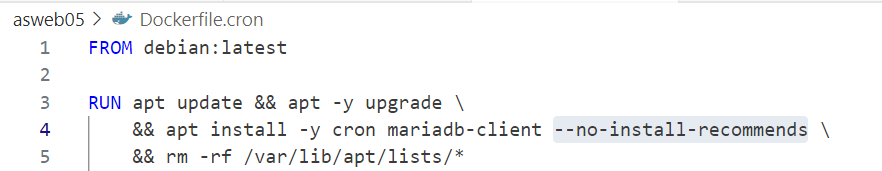
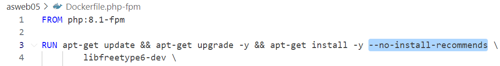


## Запуск и тестирование

Заново соберите и запустите проект. Проверьте как изменились размеры образов.

Размеры образов до:
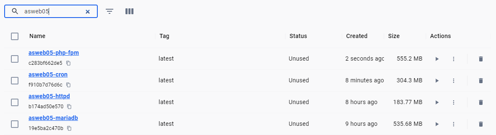

Размеры образов после:
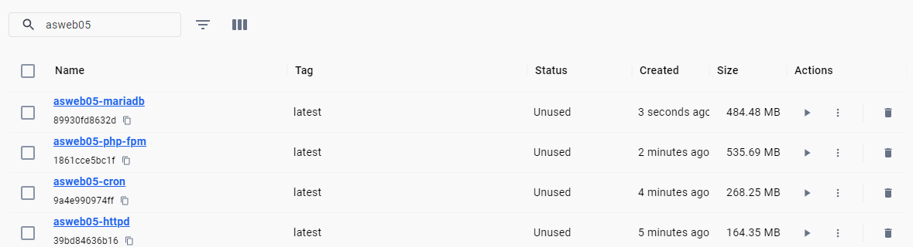

Вес образов уменьшился на несколько десятков мегабайт

## Ответьте на вопросы:

1. Существуют ли ограничения для правил устойчивости (restart policy)?
__Да, существуют определенные ограничения для правил устойчивости (restart policy) контейнеров в Docker. Они могут варьироваться в зависимости от версии Docker и используемого оркестратора контейнеров (например, Docker Swarm или Kubernetes). Некоторые из ограничений могут включать ограничение количества попыток перезапуска контейнера, определение временного окна для попыток перезапуска, условия, при которых контейнер будет перезапущен (например, только при сбое или при любом завершении контейнера), и другие.__
2. Какие еще существуют методы минимизации размеров образов? __Помимо удаления лишних файлов и пакетов, существуют и другие методы минимизации размеров образов контейнеров:__
    - __Мультистадийные сборки (Multi-stage builds)__: Этот метод позволяет уменьшить размер образа, создавая несколько этапов сборки, в каждом из которых используются только необходимые инструменты и зависимости. В конечный образ попадают только результаты работы последнего этапа сборки, что позволяет исключить из него все ненужные файлы и библиотеки.
    - __Использование минимальных базовых образов (Alpine Linux, Scratch)__: Использование минимальных базовых образов позволяет сократить размер конечного образа за счет отсутствия лишних пакетов и компонентов операционной системы. Например, образ Alpine Linux имеет небольшой размер и включает только минимальный набор необходимых компонентов.
    - __Оптимизация слоев образа (Image layers optimization)__: Разбиение процесса сборки образа на несколько этапов и аккуратное управление зависимостями позволяет оптимизировать слои образа таким образом, чтобы изменения в одном слое не приводили к пересборке всего образа целиком. Это позволяет сократить время сборки и размер конечного образа.
    - __Кэширование загрузок (Caching downloads)__: Использование кэширования загрузок пакетов и зависимостей позволяет сократить время сборки образа и минимизировать размеры промежуточных файлов, сохраняя загруженные зависимости между разными сеансами сборки.

## Вывод

В ходе выполнения лабораторной работы были рассмотрены и применены методы обеспечения безопасности и стабильности веб-серверов, работающих в контейнерах.

1. Поиск уязвимостей: Была проведена проверка образов контейнеров на наличие уязвимостей с помощью инструментов Docker Desktop. В ходе этой проверки выявлены уязвимости в некоторых образах, что может представлять угрозу для безопасности системы. Вывод сотоит в том, что всегда необходимо по возможности придерживаться последних версий приложений, утилит, операционных систем итд.

2. Ограничение ресурсов контейнера: Для обеспечения стабильной работы системы были установлены ограничения на использование процессора и памяти для каждого контейнера. Это позволяет избежать ситуаций, когда один контейнер может забирать все ресурсы, что приводит к падению других контейнеров.

3. Задание условий стабильности: Для повышения стабильности системы были указаны правила перезапуска контейнеров в случае их сбоев. Это позволяет автоматически восстанавливать работоспособность контейнеров в случае возникновения проблем.

4. Уменьшение размера образа: Для снижения размера образов существуют различные методы оптимизации, например, удаление лишних файлов и пакетов после установки. Это помогает уменьшить объем занимаемого места и ускорить процесс скачивания и развертывания образов.

Эти методы позволяют повысить уровень защиты системы и обеспечить надежную работу веб-приложений. Обеспечение безопасности и стабильности - это непрерывный процесс, и необходимо регулярно обновлять и анализировать систему на предмет уязвимостей.